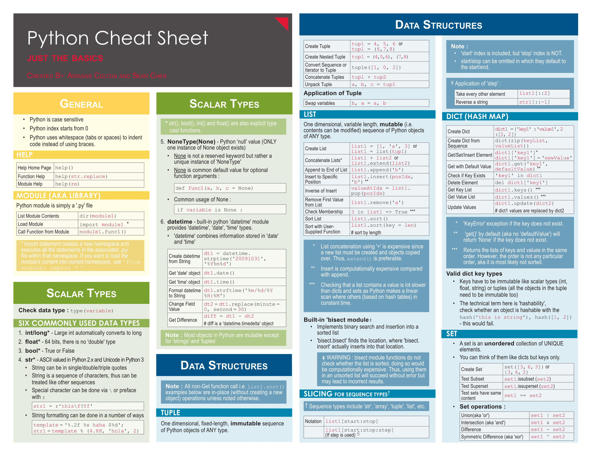
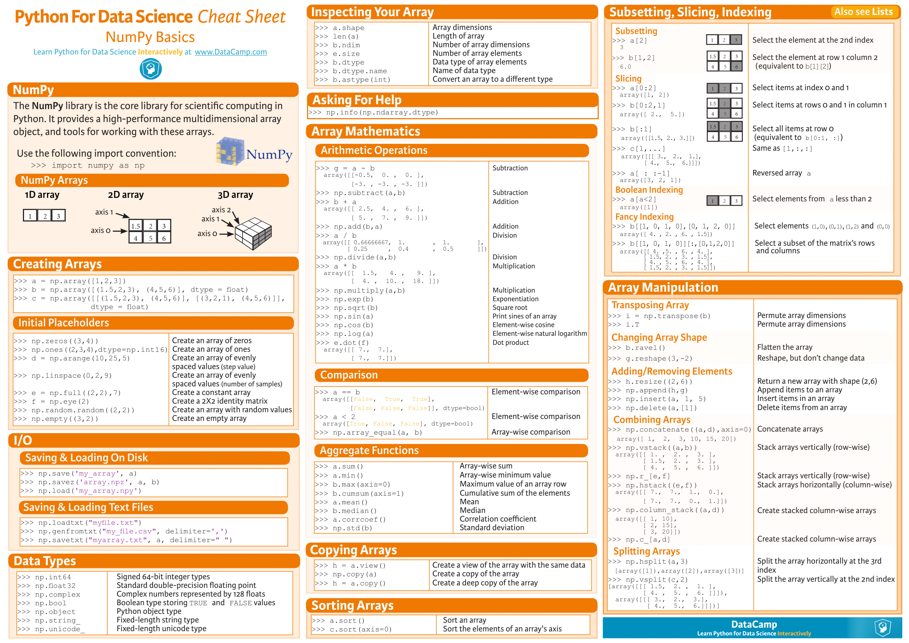
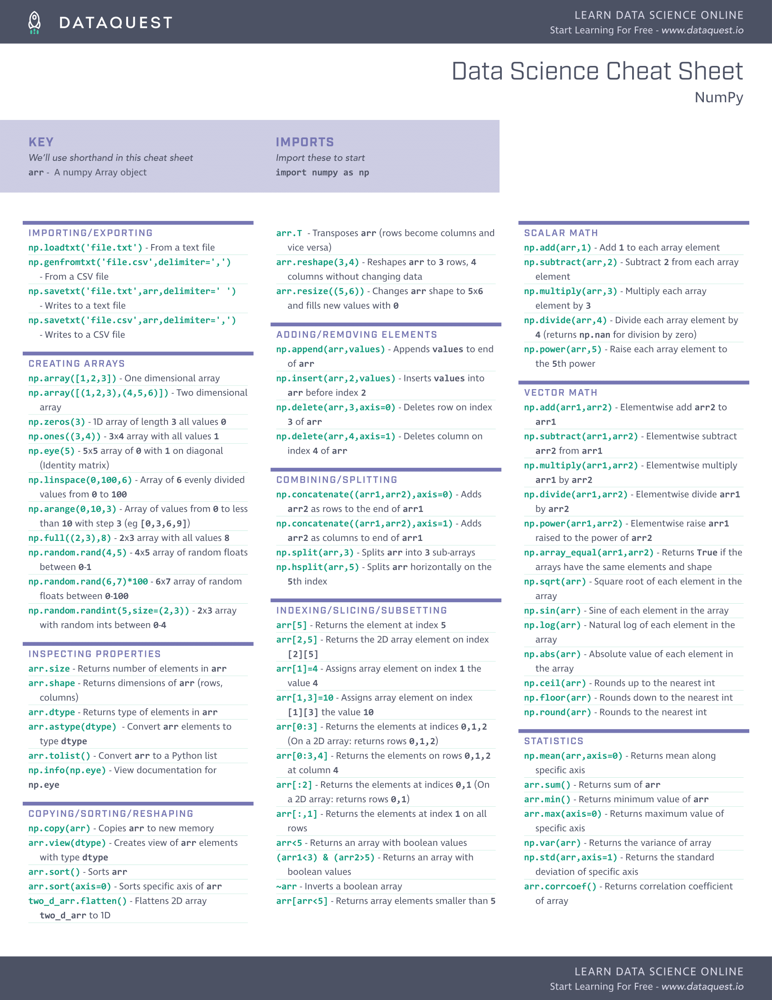
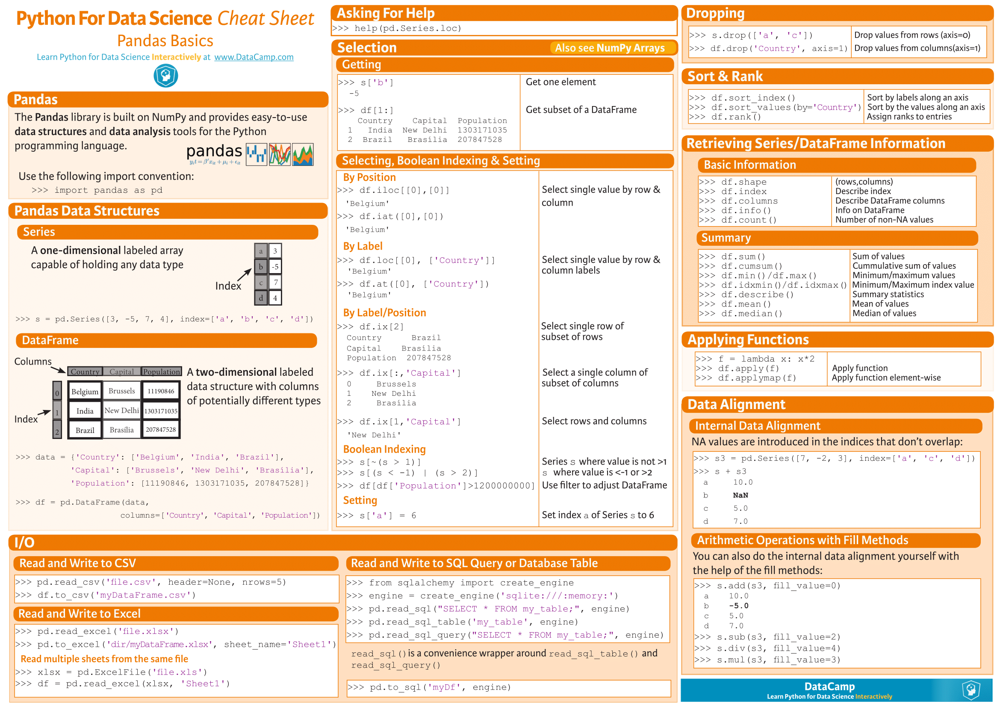
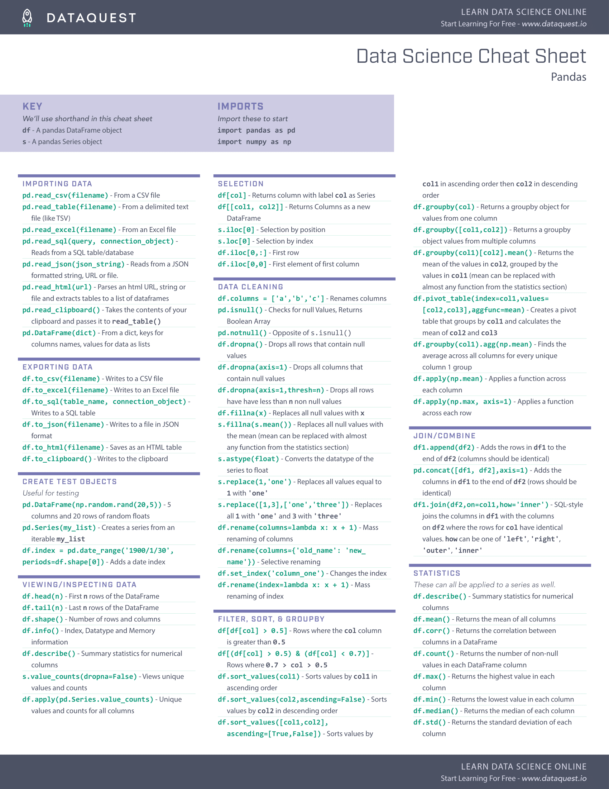
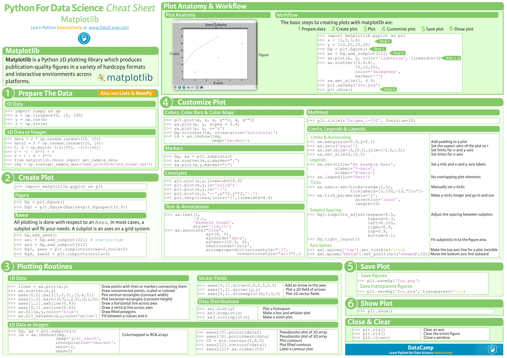

# Data-Science

Contents:

## Cheatsheets

### 1. Python

### 2. Numpy

### 3. Pandas

### 4. Matplotlib

## Mindmaps

1. [Machine Learning](https://github.com/GECA-CSE-DEPT/Data-Science/blob/master/Machine%20Learning.pdf)
2. [Deep Learning](https://github.com/GECA-CSE-DEPT/Data-Science/blob/master/Deep%20Learning.pdf)

